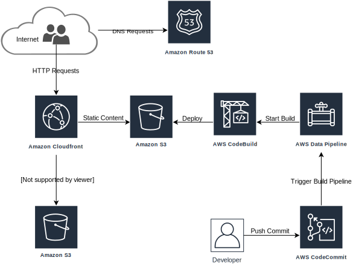

AWS Serverless Infrastructure for Static Websites

Creates a static website Infrastructure on a domain hosted on S3 and delivered by CloudFront over HTTPS with Route53 managing DNS.

Terraform Registry: [https://registry.terraform.io/modules/dannylinden/website-serverless/aws/](https://registry.terraform.io/modules/dannylinden/website-serverless/aws/)

## Features

* Redirects the following to `https://www.example.com`
  * `https://example.com`
  * `http://www.example.com`
  * `http://example.com`

* Push to CodeCommit Repository on `master` branch triggers a CodePipeline / CodeBuild run

## Used Ressources:

* [Route53](https://www.terraform.io/docs/providers/aws/r/route53_record.html)
* [S3 Bucket](https://www.terraform.io/docs/providers/aws/r/s3_bucket.html)
* [ACM Request](https://www.terraform.io/docs/providers/aws/d/acm_certificate.html)
* [Cloudfront Distribution](https://www.terraform.io/docs/providers/aws/r/cloudfront_distribution.html) 
* [CodeCommit](https://www.terraform.io/docs/providers/aws/d/codecommit_repository.html)
* [CodeBuild](https://www.terraform.io/docs/providers/aws/r/codebuild_project.html)
* [CodePipeline](https://www.terraform.io/docs/providers/aws/r/codepipeline.html)
* [IAM](https://www.terraform.io/docs/providers/aws/d/iam_user.html)



## Requirements:

### Domain

To validate the SSL certificate you need to be able to recieve Emails to:

* admin@example.com
* administrator@example.com
* postmaster@example.com
* hostmaster@example.com
* webmaster@example.com

Email-Adress 

### Module Example Usage:

```
variable "aws_access_key" {}
variable "aws_secret_key" {}

provider "aws" {
  access_key = "${var.aws_access_key}"
  secret_key = "${var.aws_secret_key}"
  region = "eu-central-1"
}

provider "aws" {
  access_key = "${var.aws_access_key}"
  secret_key = "${var.aws_secret_key}"
  region = "us-east-1"
  alias = "us-east-1"
}

module "hugo-site" {
  source = "https://github.com/dannylinden/terraform-aws-website-serverless"
  www_domain   = "www.example.com" /* Your domain here */
  root_domain = "example.com" /* Your root domain here */
  ssl-validation = "E-MAIL" How to validate
  ssh_pub_key = "" /* Path to the SSH Pub key for CodeCommit authentification*/
  bucket_prefix = "web-" /* Prefix for S3 Buckets*/
}

output "nameservers" {
  value = "${module.hugo-site.nameservers}"
}

output "git_remote_url" {
  value = "${module.hugo-site.git_remote_url}"
}

```

### Output

The Output if the Module contains:

* Git remote URL of the Repository to push the website code
* Nameserver for the Domain

## Authors
Module managed by [Danny Linden](https://www.dannylinden.de).

## License
MIT License. See LICENSE for full details.
